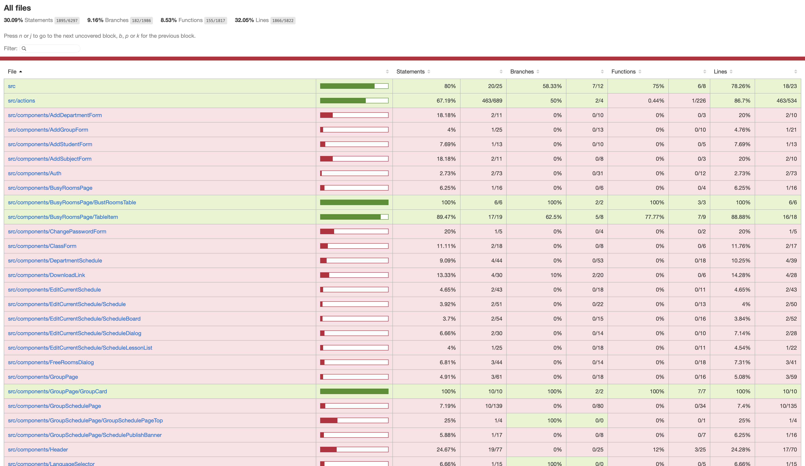

# Coverage Report

## Загальне покриття

Statements: 30.09%  
Branches: 9.16%  
Functions: 8.53%  
Lines: 32.05%

## Аналіз

Тести покривають частину helper функцій, зокрема disableComponent та formHelper.

Більшість React компонентів не мають тестів, тому загальний рівень coverage є низьким.

Branches мають найнижче покриття, оскільки не всі умовні гілки коду були перевірені.

## Висновок

Для підвищення coverage потрібно додати тести для інших helper функцій та UI компонентів.

## Скриншот

